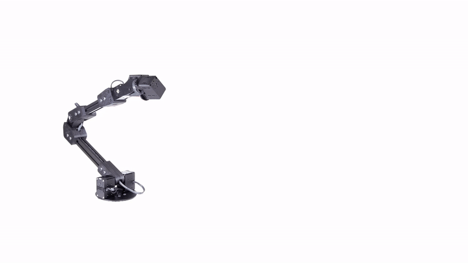

# Full-Body Visual Self-Modeling of Robot Morphologies

[Boyuan Chen](http://boyuanchen.com/),
[Robert Kwiatkowskig](https://www.linkedin.com/in/robert-kwiatkowski-7a5266201),
[Carl Vondrick](http://www.cs.columbia.edu/~vondrick/),
[Hod Lipson](https://www.hodlipson.com/)
<br>
Columbia University
<br>

### [Project Website](https://robot-morphology.cs.columbia.edu/) | [Video](https://youtu.be/aoCAplokoWE) | [Paper](http://arxiv.org/abs/)

## Overview
This repo contains the PyTorch implementation for paper "Full-Body Visual Self-Modeling of Robot Morphologies".



## Citation

If you find our paper or codebase helpful, please consider citing:

```
@article{chen2021xxx,
  title={Full-Body Visual Self-Modeling of Robot Morphologies},
  author={Chen, Boyuan and Kwiatkowskig, Robert and Vondrick, Carl and Lipson, Hod},
  journal={arXiv preprint arXiv:xxxx.xxxxx},
  year={2021}
}
```

## Content

- [Installation](#installation)
- [Data Preparation](#data-preparation)
- [About Configs and Logs](#about-configs-and-logs)
- [Training](#training)
- [Evaluation](#evaluation)

## Installation

Our code has been tested on Ubuntu 18.04 with CUDA 11.0. Create a python3.6 virtual environment and install the dependencies.

```
virtualenv -p /usr/bin/python3.6 env-visual-selfmodeling
source env-visual-selfmodeling/bin/activate
cd visual-selfmodeling
pip install -r requirements.txt
```

You may also need to run the following two lines to specify the correct cuda path for pycuda and nvcc.

```
export PATH=/usr/local/cuda-11.0/bin:$PATH
export PATH=/usr/local/cuda-11.0/bin:${PATH:+${PATH}}
```

To run the evaluation metrics, please install the additional package with the following line.

```
python setup.py build_ext --inplace
```

## Data Preparation

Run the following commands to generate the simulated data in Pybullet.

```
cd visual-selfmodeling
python sim.py
```

This will generate the mesh files in a folder named `saved_meshes` under current directory. A `robot_state.json` file will also be generated in `saved_meshes` folder to store the corresponding joint angles.

Then generate the pointcloud with normals.

```
ipython3
from utils import common
common.convert_ply_to_xyzn(folder='./saved_meshes')
```

## About Configs and Logs

Before training and evaluation, we first introduce the configuration and logging structure.

**Configs:** all the specific parameters used for training and evaluation are indicated in `./configs/state_condition/config1.yaml`. If you would like to play with other parameters, feel free to copy the existing config file and modify it. You will then just need to change the config file path in the following training steps to point to the new configuration file.

To train the self-model which also predicts the end effector position together with our visual self-model, please use `./configs/state_condition_kinematic/config1.yaml`.

To train the self-model which only predicts the end effector from scratch, without out visual self-model, please use `./configs/state_condition_kinematic_scratch/config1.yaml`.

If you save the data to other directories, please make sure the `data_filepath` argument in each config file points to the correct path.

**Logs:** both the training and evaluation results will be saved in the log folder for each experiment. The log folders will be located under `./scripts` folder. The last digit in the logs folder indicates the random seed. Inside the logs folder, the structure and contents are:

    ```
    \logs_True_False_False_image_conv2d-encoder-decoder_True_{output_representation}_{seed}
        \lightning_logs
            \checkpoints          [saved checkpoint]
            \version_0            [training stats]
        \predictions              [complete predicted meshes before normalization]
        \predictions_denormalized [complete predicted meshes after normalization]
    ```

## Training

To train our visual self-model, run the following command.

```
cd scripts;
CUDA_VISIBLE_DEVICES=0 python ../main.py ../configs/state_condition/config1.yaml NA;
```

To use our pre-trained self-model to train a small network to predict end-effector position, run the following command. For this step, please uncomment the validation code in `models.py` (line 143-158, line 202-204, and line 225-231). Please only uncomment then for this particular step.

```
cd scripts;
CUDA_VISIBLE_DEVICES=0 python ../main.py ../configs/state_condition_kinematic/config1.yaml kinematic ./logs_state-condition_new-global-siren-sdf_1/lightning_logs/version_0/checkpoints/;
```

To train the baseline model that predicts end-effector position from scratch, without using our visual self-model, run the following command. For this step, please uncomment the validation code in `models.py` (line 143-158, line 202-204, and line 225-231). Please only uncomment then for this particular step.

```
CUDA_VISIBLE_DEVICES=0 python ../main.py ../configs/state_condition_kinematic_scratch/config1.yaml kinematic-scratch NA;
```

## Evaluation

To evaluate the predicted meshes and compare with baselines, run the following commands.

```
cd scripts;
CUDA_VISIBLE_DEVICES=0 python ../eval.py ../configs/state_condition/config1.yaml ./logs_state-condition_new-global-siren-sdf_1/lightning_logs/version_0/checkpoints/ eval-state-condition;

cd utils;
python eval_mesh.py ../configs/state_condition/config1.yaml model;
python eval_mesh.py ../configs/state_condition/config1.yaml nearest-neighbor;
python eval_mesh.py ../configs/state_condition/config1.yaml random;

CUDA_VISIBLE_DEVICES=0 python ../eval.py ../configs/state_condition_kinematic/config1.yaml ./logs_state-condition-kinematic_new-global-siren-sdf_1/lightning_logs/version_0/checkpoints/ eval-kinematic ./logs_state-condition_new-global-siren-sdf_1/lightning_logs/version_0/checkpoints/;

CUDA_VISIBLE_DEVICES=4 python ../eval.py ../configs/state_condition_kinematic_scratch/config1.yaml ./logs_state-condition-kinematic-scratch_new-global-siren-sdf_1/lightning_logs/version_0/checkpoints/ eval-kinematic;
```

## License

This repository is released under the MIT license. See [LICENSE](LICENSE) for additional details.

## Reference

- https://github.com/vsitzmann/siren
- https://github.com/autonomousvision/occupancy_networks/